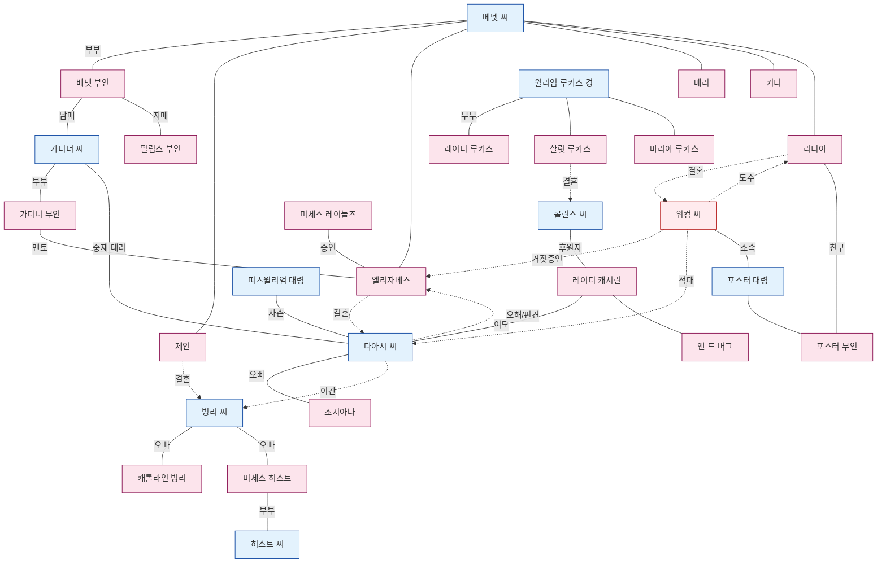

# 인물관계도 (Pride and Prejudice)

소설 전체 인물을 가문·그룹 단위로 정리하고, 주요 서사 아크별 관계 구조를 시각화한다. 각 인물의 상세 이력은 개별 `.md` 파일을 참조.

---

## 1. 가문·그룹별 인물 구성

### 베넷 가 (Longbourn, Hertfordshire)
한정상속(entail)으로 남성 상속인이 없으면 콜린스에게 넘어가는 운명에 놓인 젠트리 가문. 다섯 딸의 혼인이 가문의 유일한 생존 전략.

```
Mr. Bennet ─── Mrs. Bennet
       │
       ├── Jane (장녀, 22세) ──→ Mr. Bingley
       ├── Elizabeth "Lizzy" (차녀, 20세) ──→ Mr. Darcy
       ├── Mary (3녀)
       ├── Kitty (Catherine, 4녀)
       └── Lydia (막내, 15세) ──→ Mr. Wickham
```

- **부부 관계**: 냉소적 남편-분별 없는 아내. 결혼의 실패가 양육 실패로 이어졌다는 것이 작품의 은근한 고발.
- **부친-엘리자베스**: 가문 내 유일한 지적 교류. 편애가 노골적.
- **모친-리디아**: 막내딸은 어머니의 가장 총애받는 자식이자 분별 없음의 복제.

### 다아시 가 (Pemberley, Derbyshire)
연 1만 파운드, 대귀족 가문. 펨벌리는 원작의 상징적 중심지.

```
[故 다아시 부친 — 고 다아시 부인]
          │
          ├── Mr. Darcy (Fitzwilliam Darcy, 28세경)
          └── Georgiana Darcy (여동생, 16세)

외가(모계) 쪽:
Lady Catherine de Bourgh — [故 Sir Lewis de Bourgh]
          │                        │
   (Lady Anne Darcy의 자매)     Miss de Bourgh (Anne, 사촌)
                                    └── Mrs. Jenkinson (동반자)

사촌:
Colonel Fitzwilliam (Earl ___의 차남, 다아시의 공동 후견인)

하인/관리인:
Mrs. Reynolds (펨벌리 하우스키퍼, 다아시를 4세부터 알고 지냄)
```

- **다아시-조지아나**: 15세 연상 오빠, 아버지 사후 공동 후견인. 유일한 혈육이자 가장 소중한 보호 대상.
- **레이디 캐서린-다아시**: 이모. 드 버그 양과의 정략혼을 기대하나 다아시 측 의사는 전무.
- **피츠윌리엄-다아시**: 사촌이자 조지아나의 공동 후견인. 헌스포드 체류 중 엘리자베스에게 빙리-제인 이간의 결정적 정보를 무심히 누설(EVT-027).

### 빙리 가 (Netherfield 임차 중)
아버지의 상업으로 축적된 재산(10만 파운드)을 가진 신흥 부유층. 영지 매입을 통한 젠트리 편입이 가문의 목표.

```
Mr. Bingley (찰스, 5,000/yr)
      │
   ├── Miss Bingley (Caroline, 미혼 여동생)
   └── Mrs. Hurst (Louisa, 언니) ── Mr. Hurst (게으른 한량)
```

- **빙리-다아시**: 친구이자 멘토 관계. 빙리가 다아시에게 거의 맹목적으로 의존.
- **캐롤라인-다아시**: 일방적 구애. 엘리자베스를 향한 다아시의 관심을 최대 위협으로 인식.
- **캐롤라인-제인**: 위선적 우정. 이간의 공모자.

### 콜린스-루카스 (Hunsford / Lucas Lodge)
한정상속과 사회적 상승이 만나는 접점.

```
Sir William Lucas ─── Lady Lucas
       │
       ├── Charlotte (27세) ──→ Mr. Collins (결혼)
       ├── Maria (동생)
       └── (남동생들)

Mr. Collins
  — 베넷 씨의 5촌 조카, 롱번 상속 예정자
  — 헌스포드 교구 목사
  — 후원자: Lady Catherine de Bourgh
```

- **콜린스-레이디 캐서린**: 극도의 아부 관계. 콜린스의 모든 행동 기준.
- **샬럿-엘리자베스**: 친밀한 우정이 결혼관 충돌로 균열(EVT-020).
- **콜린스-엘리자베스**: 청혼 후 거절 → 조용한 증오.

### 가디너·필립스 (외가, 베넷 부인의 친정)
베넷 부인의 형제들. 같은 혈연이지만 극단적 양극을 이룬다.

```
Mr. Gardiner (베넷 부인의 오빠, 런던 상인)
       ── Mrs. Gardiner (더비셔 램튼 출신)
       — Gracechurch Street, Cheapside 거주
       — 작품 내 도덕적 앵커

Mrs. Philips (베넷 부인의 언니)
       — Mr. Philips (메리턴 변호사, 前 베넷 씨 아버지의 서기)
       — 메리턴 거주, 분별 없음의 또 다른 표본
```

- **가디너 부부-엘리자베스/제인**: 친구이자 멘토. 조카들의 구원자.
- **가디너 부인-엘리자베스**: 초기 위컴 경고 → 펨벌리 인도 → EVT-042 결정적 편지의 3단계 멘토십.
- **가디너 씨**: 리디아 도주 위기의 실질적 가장 역할. 표면적으로는 리디아 결혼의 주선자(실제는 다아시의 대리인).

### 민병대 인맥 (Meryton)
가을-겨울 메리턴에 주둔한 ___ 민병대. 위컴을 매개로 베넷 가와 얽힌다.

```
Colonel Forster ─── Mrs. Forster (신혼, 리디아의 친구)
       │
       ├── Mr. Wickham (군 소위, 후에 정규군 소위)
       ├── Mr. Denny (위컴의 친구)
       └── Captain Carter
```

- **포스터 부인-리디아**: 또래 친구 관계가 리디아 브라이튼 동반의 명분이 됨(EVT-032).
- **포스터 대령-베넷 씨**: 리디아 도주 추적 협력자.

### 기타 인물
- **Miss King (메리 킹)**: 1만 파운드 상속녀. 위컴의 일시적 구애 대상(EVT-022).
- **Mrs. Younge**: 조지아나의 前 동반자. 위컴과 공모해 조지아나 유혹 미수 사건(1년 전). 리디아-위컴 런던 도주 때 은신처 제공.
- **Mr. Jones**: 메리턴 의사(apothecary). 제인의 감기 치료.
- **Mrs. Reynolds**: 펨벌리 하우스키퍼. 엘리자베스의 다아시 인식 전환의 핵심 증언자(EVT-035).

---

## 2. 핵심 서사 아크

### 아크 1: 이중 결혼 플롯 (Two Courtships)
소설의 주축.

```
[제인-빙리 선]                    [엘리자베스-다아시 선]
    상호 호감 (EVT-003)                메리턴 모욕 (EVT-003)
         ↓                                   ↓
    네더필드 체류 (EVT-006)           'fine eyes' 끌림 (EVT-004)
         ↓                                   ↓
    빙리의 철수 (EVT-019)              대결 심화 (EVT-009, 016)
         ↓                                   ↓
    ★ 다아시의 이간 ──────────────→ 첫 청혼 실패 (EVT-028)
         ↓                                   ↓
    런던의 고통 (EVT-021, 023)       다아시의 편지 (EVT-029)
         ↓                                   ↓
    이간 해제 ←───────────────── 펨벌리 재회 (EVT-036)
         ↓                                   ↓
    빙리 귀환 (EVT-043)              비밀 구출 (EVT-042)
         ↓                                   ↓
    빙리 청혼 (EVT-044)              두 번째 청혼 (EVT-046)
         ↓                                   ↓
              ★ 이중 결혼 (EVT-048) ★
```

다아시가 두 선의 교차점: 제인 선의 방해자였다가 해결사로, 엘리자베스 선의 주체로서 거절 → 자기 개혁 → 재청혼.

### 아크 2: 편견의 형성과 해소
엘리자베스의 인식 변화가 서사의 또 다른 축.

```
다아시 → 위컴 (유년의 동료)
   ↓   학대(거짓)
위컴 → 엘리자베스 (EVT-014, 거짓 증언)
   ↓   편견 주입
엘리자베스 → 다아시 (혐오 고착)
   ↓   첫 청혼 거절(EVT-028)
다아시 → 엘리자베스 (편지, EVT-029)
   ↓   진실 폭로
엘리자베스 → 자신 (EVT-030, "I never knew myself")
   ↓   편견 해소
엘리자베스 → 다아시 (존경·감사·사랑, EVT-035, 041)
```

### 아크 3: 위컴의 파괴 경로
위컴은 3건의 유혹을 시도한다.

```
1) 조지아나 다아시 (1년 전, 미수) — 다아시가 직전에 발각, EVT-029 편지로 폭로
2) Miss King (메리턴, 미수) — 삼촌이 개입해 발람, EVT-022
3) Lydia Bennet (브라이튼→런던, 도주 성공) — 다아시가 돈으로 봉합, EVT-038~042
```

위컴의 공범: **Mrs. Younge** (1년 전 조지아나 건, 리디아 도주 은신처 제공).

### 아크 4: 한정상속의 압력
엔테일(entail)이 결혼 플롯의 구조적 배경.

```
Mr. Bennet 사망 시
    ↓ entail (male heir only)
Mr. Collins 상속
    ↓
Mrs. Bennet + 미혼 딸들 → 빈곤 위협

압력의 결과:
  — 베넷 부인의 결혼 강박
  — 콜린스의 베넷 딸 청혼 (의무감 + 상속 화해)
  — 샬럿의 콜린스 수락 (27세, 경제적 방어)
```

### 아크 5: 멘토·조력자 구조
엘리자베스의 성장을 뒷받침하는 성인 멘토 네트워크.

```
가디너 부부 ─ 도덕적 멘토
    ├── 위컴 경고
    ├── 펨벌리 인도
    └── 리디아 구출(다아시의 대리)

Mrs. Reynolds ─ 다아시 인식 전환의 외부 증언자

Colonel Fitzwilliam ─ 정보의 무심한 전달자 (EVT-027)

Mrs. Gardiner's 편지 (EVT-042) ─ 비밀 중재의 폭로자
```

### 아크 6: 안타고니스트 축
소설의 구조적 적대자들.

```
Lady Catherine de Bourgh
  — 계급 질서의 화신
  — 엘리자베스에게 직접 협박 (EVT-045)
  — 그러나 역설적으로 재청혼의 촉매 역할

Miss Bingley
  — 계급 상승 욕구의 화신
  — 이간 공모자, 펨벌리 정중한 경계

Mr. Collins
  — 아부와 허영의 화신
  — 적대라기보다 풍자 대상

Mr. Wickham
  — 진짜 악당 (유일)
  — 여성 유혹, 거짓말, 도박
```

---

## 3. Mermaid 관계도



---

## 4. 주요 거주지·장소와의 연결

| 장소 | 거주/연고 인물 |
|------|----------------|
| **Longbourn** | 베넷 가 전원 |
| **Netherfield Park** | 빙리(임차), 다아시·허스트 가족 체류 |
| **Pemberley** (Derbyshire) | 다아시·조지아나, Mrs. Reynolds |
| **Rosings Park** (Kent) | 레이디 캐서린·미스 드 버그, Mrs. Jenkinson |
| **Hunsford Parsonage** | 콜린스·샬럿 |
| **Lucas Lodge** | 루카스 가 |
| **Meryton** | 필립스 가, 민병대, Miss King |
| **Gracechurch Street** (London) | 가디너 가 |
| **Grosvenor Street / Hurst's house** (London) | 허스트·미스 빙리 겨울 체류지 |
| **Brighton** | 포스터 부부·리디아·위컴(도주 전) |
| **Lambton** (Derbyshire) | 가디너 부인 친정, 펨벌리 방문 거점 |
| **Gretna Green** (Scotland) | 리디아 도주 위장 목적지(실제 미도달) |
| **Newcastle** | 결혼 후 위컴-리디아 정규군 연대 |

---

## 5. 결말 시점 최종 배치

- **펨벌리 (Darcy ↔ Elizabeth)**: 조지아나 동거. 가디너 부부를 가장 사랑받는 친척으로 초대.
- **Netherfield → Derbyshire(1년 후) (Bingley ↔ Jane)**: 다아시 영지 30마일 내 이주.
- **Longbourn (Bennet 부부 + Mary + Kitty)**: Kitty는 언니들의 영향으로 개선, Mary는 집의 유일한 딸로 남음.
- **Newcastle (Wickham ↔ Lydia)**: 만성 금전난, 누나들에게 지원 요청. 다아시는 펨벌리 출입 금지.
- **Rosings (Lady Catherine)**: 한동안 절연하다 화해.
- **Hunsford (Collins ↔ Charlotte)**: 레이디 캐서린의 그늘 아래 유지.
- **Gracechurch Street (Gardiners)**: 다아시·엘리자베스 부부와 깊은 교류 지속.

---

*참조: 각 인물 상세는 `[인물명].md` 파일. 사건 번호(EVT-XXX)는 `event_master.csv` 참조.*
