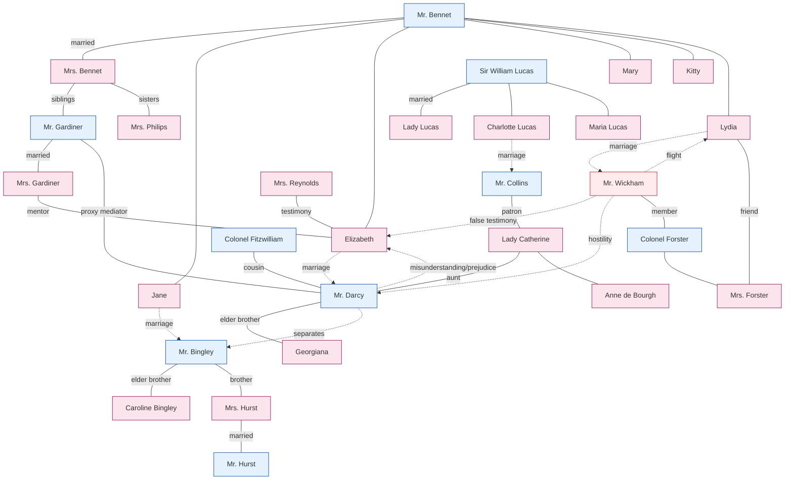

# Character Relationship Map — Pride and Prejudice

This document organizes every character in the novel by family and group, then visualizes the relationship structures of the major narrative arcs. See each character's individual `.md` file for a detailed history.

---

## 1. Characters by Family and Group

### The Bennet Family — Longbourn, Hertfordshire
A gentry family whose estate will pass to Collins under the entail if there is no male heir. Marriage is the family's only survival strategy for its five daughters.

```
Mr. Bennet ─── Mrs. Bennet
       │
       ├── Jane, eldest daughter, 22 ──→ Mr. Bingley
       ├── Elizabeth “Lizzy,” second daughter, 20 ──→ Mr. Darcy
       ├── Mary, third daughter
       ├── Kitty, Catherine, fourth daughter
       └── Lydia, youngest daughter, 15 ──→ Mr. Wickham
```

- **Husband and wife:** a cynical husband and a foolish wife. The novel quietly indicts the way a failed marriage produces failed parenting.
- **Father and Elizabeth:** the only intellectual exchange within the family, accompanied by open favoritism.
- **Mother and Lydia:** the youngest daughter is her mother's favorite child and a replica of her lack of judgment.

### The Darcy Family — Pemberley, Derbyshire
A great aristocratic family with an annual income of £10,000. Pemberley is the symbolic center of the original novel.

```
[Late Mr. Darcy — late Lady Anne Darcy]
          │
          ├── Mr. Darcy, Fitzwilliam Darcy, about 28
          └── Georgiana Darcy, younger sister, 16

Maternal family:
Lady Catherine de Bourgh — [late Sir Lewis de Bourgh]
          │                        │
   sister of Lady Anne Darcy    Miss de Bourgh, Anne, cousin
                                    └── Mrs. Jenkinson, companion

Cousin:
Colonel Fitzwilliam, second son of Earl ___ and Darcy's fellow guardian

Servant and estate staff:
Mrs. Reynolds, Pemberley housekeeper, has known Darcy since he was four
```

- **Darcy and Georgiana:** an elder brother fifteen years her senior and her co-guardian after their father's death. She is his only close blood relation and most precious charge.
- **Lady Catherine and Darcy:** his maternal aunt. She expects him to make a dynastic marriage with Miss de Bourgh, although Darcy has no such intention.
- **Fitzwilliam and Darcy:** cousins and Georgiana's co-guardians. During the Hunsford stay, Fitzwilliam inadvertently gives Elizabeth the decisive information about Darcy separating Bingley and Jane (EVT-027).

### The Bingley Family — Leasing Netherfield
A newly wealthy family with a £100,000 fortune made through the father's trade. Its goal is entry into the gentry through the purchase of an estate.

```
Mr. Bingley, Charles, £5,000 a year
      │
   ├── Miss Bingley, Caroline, unmarried younger sister
   └── Mrs. Hurst, Louisa, elder sister ── Mr. Hurst, idle man of leisure
```

- **Bingley and Darcy:** friends in a mentor relationship. Bingley depends on Darcy almost blindly.
- **Caroline and Darcy:** one-sided courtship. She sees Darcy's interest in Elizabeth as her greatest threat.
- **Caroline and Jane:** a hypocritical friendship; Caroline conspires in separating the couple.

### Collins and Lucas — Hunsford and Lucas Lodge
The point where the entail and social advancement meet.

```
Sir William Lucas ─── Lady Lucas
       │
       ├── Charlotte, 27 ──→ Mr. Collins, marriage
       ├── Maria, younger sister
       └── younger brothers

Mr. Collins
  — Mr. Bennet's distant cousin and heir presumptive to Longbourn
  — clergyman of Hunsford parish
  — patron: Lady Catherine de Bourgh
```

- **Collins and Lady Catherine:** a relationship of extreme flattery. She supplies the standard for all his conduct.
- **Charlotte and Elizabeth:** an intimate friendship fractured by their conflicting views of marriage (EVT-020).
- **Collins and Elizabeth:** proposal followed by rejection, then quiet resentment.

### The Gardiners and Philipses — Mrs. Bennet's Family
Mrs. Bennet's siblings, who form opposite poles despite their shared blood.

```
Mr. Gardiner, Mrs. Bennet's brother and a London merchant
       ── Mrs. Gardiner, from Lambton in Derbyshire
       — lives on Gracechurch Street, Cheapside
       — a moral anchor within the novel

Mrs. Philips, Mrs. Bennet's sister
       — Mr. Philips, Meryton attorney and former clerk to Mr. Bennet's father
       — lives in Meryton; another example of poor judgment
```

- **The Gardiners and Elizabeth and Jane:** friends and mentors, and the nieces' rescuers.
- **Mrs. Gardiner and Elizabeth:** a three-stage mentorship—early warning about Wickham, guidance to Pemberley, then the decisive EVT-042 letter.
- **Mr. Gardiner:** acts as the true head of the family during the crisis of Lydia's elopement. On the surface he arranges Lydia's marriage; in fact, he acts as Darcy's proxy.

### Militia Connections — Meryton
The ___ militia stationed in Meryton during autumn and winter, entwined with the Bennet family through Wickham.

```
Colonel Forster ─── Mrs. Forster, newly married and Lydia's friend
       │
       ├── Mr. Wickham, militia lieutenant, later a regular-army ensign
       ├── Mr. Denny, Wickham's friend
       └── Captain Carter
```

- **Mrs. Forster and Lydia:** their friendship as peers becomes the justification for Lydia accompanying her to Brighton (EVT-032).
- **Colonel Forster and Mr. Bennet:** cooperate in tracing Lydia after the elopement.

### Other Characters
- **Miss King, Mary King:** heiress to £10,000 and a temporary object of Wickham's courtship (EVT-022).
- **Mrs. Younge:** Georgiana's former companion. She conspires with Wickham in the attempted seduction of Georgiana one year earlier and provides a hiding place during Lydia and Wickham's flight to London.
- **Mr. Jones:** Meryton apothecary who treats Jane's cold.
- **Mrs. Reynolds:** Pemberley housekeeper and the decisive witness in Elizabeth's changed understanding of Darcy (EVT-035).

---

## 2. Core Narrative Arcs

### Arc 1: Double-Marriage Plot — Two Courtships
The novel's main axis.

```
[Jane–Bingley line]                  [Elizabeth–Darcy line]
    Mutual attraction, EVT-003           Meryton insult, EVT-003
         ↓                                   ↓
    Netherfield stay, EVT-006            “fine eyes” attraction, EVT-004
         ↓                                   ↓
    Bingley's departure, EVT-019          Conflict deepens, EVT-009 and 016
         ↓                                   ↓
    ★ Darcy's separation ─────────────→ Failed first proposal, EVT-028
         ↓                                   ↓
    Pain in London, EVT-021 and 023       Darcy's letter, EVT-029
         ↓                                   ↓
    Separation undone ←──────────── Pemberley reunion, EVT-036
         ↓                                   ↓
    Bingley returns, EVT-043              Secret rescue, EVT-042
         ↓                                   ↓
    Bingley proposes, EVT-044             Second proposal, EVT-046
         ↓                                   ↓
              ★ Double marriage, EVT-048 ★
```

Darcy is the point where the two lines cross: he moves from obstructer to problem-solver on Jane's line, while on Elizabeth's line he moves from rejection through self-reform to a renewed proposal.

### Arc 2: Formation and Dissolution of Prejudice
Elizabeth's changing understanding forms the narrative's other axis.

```
Darcy → Wickham, childhood companions
   ↓   mistreatment, falsely claimed
Wickham → Elizabeth, EVT-014, false testimony
   ↓   prejudice implanted
Elizabeth → Darcy, hatred hardens
   ↓   rejects first proposal, EVT-028
Darcy → Elizabeth, letter, EVT-029
   ↓   truth revealed
Elizabeth → herself, EVT-030, “I never knew myself”
   ↓   prejudice dissolves
Elizabeth → Darcy, respect, gratitude, and love, EVT-035 and 041
```

### Arc 3: Wickham's Path of Destruction
Wickham attempts three seductions.

```
1) Georgiana Darcy, one year earlier, failed—Darcy discovers it just in time; revealed in the EVT-029 letter
2) Miss King, Meryton, failed—her uncle intervenes and removes her, EVT-022
3) Lydia Bennet, Brighton → London, successful flight—Darcy settles it with money, EVT-038–042
```

Wickham's accomplice: **Mrs. Younge**, in the Georgiana affair one year earlier and in providing a hiding place during Lydia's flight.

### Arc 4: Pressure of the Entail
The entail provides the structural background to the marriage plot.

```
Upon Mr. Bennet's death
    ↓ entail, male heir only
Mr. Collins inherits
    ↓
Mrs. Bennet and unmarried daughters → threat of poverty

Consequences of the pressure:
  — Mrs. Bennet's obsession with marriage
  — Collins proposes to a Bennet daughter, from duty and to reconcile the inheritance
  — Charlotte accepts Collins, economic defense at age 27
```

### Arc 5: Mentor and Helper Structure
The adult mentor network that supports Elizabeth's growth.

```
The Gardiners ─ moral mentors
    ├── warning about Wickham
    ├── guidance to Pemberley
    └── Lydia's rescue, as Darcy's proxies

Mrs. Reynolds ─ external witness who changes Elizabeth's view of Darcy

Colonel Fitzwilliam ─ inadvertent bearer of information, EVT-027

Mrs. Gardiner's letter, EVT-042 ─ revealer of the secret intervention
```

### Arc 6: Antagonist Axis
The novel's structural antagonists.

```
Lady Catherine de Bourgh
  — embodiment of the class order
  — directly threatens Elizabeth, EVT-045
  — yet paradoxically catalyzes the second proposal

Miss Bingley
  — embodiment of the desire for social ascent
  — conspirator in the separation; politely held at a distance at Pemberley

Mr. Collins
  — embodiment of flattery and vanity
  — an object of satire rather than an antagonist

Mr. Wickham
  — the only true villain
  — seduction, lies, and gambling
```

---

## 3. Mermaid Relationship Diagram



---

## 4. Connections to Major Residences and Locations

| Location | Residents or Affiliated Characters |
|------|----------------|
| **Longbourn** | Entire Bennet family |
| **Netherfield Park** | Bingley, leasing; Darcy and the Hursts staying |
| **Pemberley**, Derbyshire | Darcy, Georgiana, and Mrs. Reynolds |
| **Rosings Park**, Kent | Lady Catherine, Miss de Bourgh, and Mrs. Jenkinson |
| **Hunsford Parsonage** | Collins and Charlotte |
| **Lucas Lodge** | Lucas family |
| **Meryton** | Philips family, militia, and Miss King |
| **Gracechurch Street**, London | Gardiner family |
| **Grosvenor Street / Hurst's house**, London | Winter residence of the Hursts and Miss Bingley |
| **Brighton** | The Forsters, Lydia, and Wickham before the flight |
| **Lambton**, Derbyshire | Mrs. Gardiner's hometown and the base for visiting Pemberley |
| **Gretna Green**, Scotland | False destination of Lydia's flight, never actually reached |
| **Newcastle** | Wickham and Lydia's regular-army regiment after marriage |

---

## 5. Final Disposition at the End

- **Pemberley, Darcy ↔ Elizabeth:** Georgiana lives with them. They welcome the Gardiners as their most beloved relatives.
- **Netherfield → Derbyshire one year later, Bingley ↔ Jane:** they move within thirty miles of Darcy's estate.
- **Longbourn, Mr. and Mrs. Bennet, Mary, and Kitty:** Kitty improves under her sisters' influence; Mary remains the only daughter at home.
- **Newcastle, Wickham ↔ Lydia:** chronic financial difficulty and requests for support from her sisters. Darcy forbids Wickham entry to Pemberley.
- **Rosings, Lady Catherine:** she breaks with them for a time, then reconciles.
- **Hunsford, Collins ↔ Charlotte:** they remain under Lady Catherine's shadow.
- **Gracechurch Street, the Gardiners:** they continue their close relationship with Darcy and Elizabeth.

---

*Reference: see each `[Character Name].md` file for details. For event numbers (EVT-XXX), see `event_master.csv`.*
