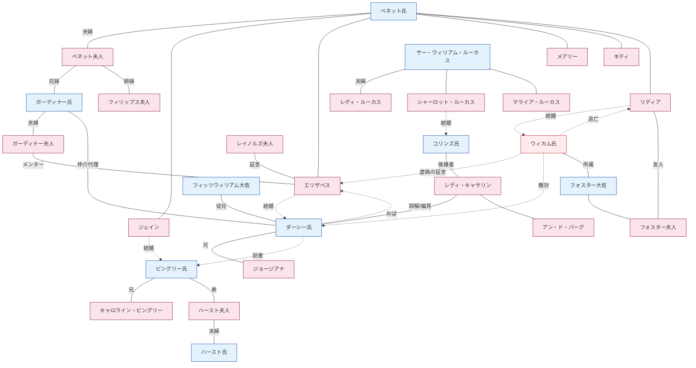

# 『高慢と偏見』人物関係図

小説の全登場人物を家門・グループ別に整理し、主要な物語アークごとの関係構造を可視化する。各人物の詳しい履歴は個別の`.md`ファイルを参照すること。

---

## 1. 家門・グループ別の人物構成

### ベネット家――ハートフォードシャー、ロングボーン
限嗣相続により、男子相続人がいなければ領地がコリンズへ渡る運命にあるジェントリの家門。5人の娘の結婚が、家門にとって唯一の生存戦略である。

```
ベネット氏 ─── ベネット夫人
       │
       ├── ジェイン（長女、22歳）──→ ビングリー氏
       ├── エリザベス「リジー」（次女、20歳）──→ ダーシー氏
       ├── メアリー（三女）
       ├── キティ（キャサリン、四女）
       └── リディア（末娘、15歳）──→ ウィカム氏
```

- **夫婦関係：**冷笑的な夫と分別のない妻。結婚の失敗が養育の失敗につながったことを、作品は静かに告発する。
- **父とエリザベス：**家族内で唯一の知的交流。偏愛は露骨である。
- **母とリディア：**末娘は母親がもっとも可愛がる子であり、その分別のなさを写した存在でもある。

### ダーシー家――ダービーシャー、ペンバリー
年収1万ポンドの大貴族家門。ペンバリーは原作の象徴的中心である。

```
[故ダーシー氏――故アン・ダーシー夫人]
          │
          ├── ダーシー氏（フィッツウィリアム・ダーシー、28歳前後）
          └── ジョージアナ・ダーシー（妹、16歳）

母方の家門：
レディ・キャサリン・ド・バーグ――[故ルイス・ド・バーグ卿]
          │                        │
   （アン・ダーシー夫人の姉妹）    ミス・ド・バーグ（アン、従妹）
                                    └── ジェンキンソン夫人（付き添い）

従兄：
フィッツウィリアム大佐（___伯爵の次男、ダーシーと共同の後見人）

使用人・管理人：
レイノルズ夫人（ペンバリーの家政婦、ダーシーが4歳の頃から知る）
```

- **ダーシーとジョージアナ：**15歳年上の兄で、父の死後は共同後見人。彼女は唯一の近親であり、もっとも大切な保護対象である。
- **レディ・キャサリンとダーシー：**母方のおば。ミス・ド・バーグとの政略結婚を期待するが、ダーシーにその意思はまったくない。
- **フィッツウィリアムとダーシー：**従兄同士であり、ジョージアナの共同後見人。ハンスフォード滞在中、フィッツウィリアムはビングリーとジェインを引き離したダーシーの行為について、決定的な情報をうっかりエリザベスに漏らす（EVT-027）。

### ビングリー家――ネザーフィールドを賃借中
父の商業で築いた10万ポンドの財産を持つ新興富裕層。領地を購入してジェントリへ加わることが家門の目標である。

```
ビングリー氏（チャールズ、年収5,000ポンド）
      │
   ├── ミス・ビングリー（キャロライン、未婚の妹）
   └── ハースト夫人（ルイーザ、姉）── ハースト氏（怠惰な遊び人）
```

- **ビングリーとダーシー：**友人であり、師弟に近い関係。ビングリーはほとんど盲目的にダーシーへ依存する。
- **キャロラインとダーシー：**一方的な求愛。ダーシーがエリザベスに示す関心を最大の脅威と見なす。
- **キャロラインとジェイン：**偽善的な友情。二人を引き離す共謀者である。

### コリンズとルーカス――ハンスフォード／ルーカス・ロッジ
限嗣相続と社会的上昇が交わる接点。

```
サー・ウィリアム・ルーカス ─── レディ・ルーカス
       │
       ├── シャーロット（27歳）──→ コリンズ氏（結婚）
       ├── マライア（妹）
       └── 弟たち

コリンズ氏
  — ベネット氏の遠縁で、ロングボーンの推定相続人
  — ハンスフォード教区の牧師
  — 後援者：レディ・キャサリン・ド・バーグ
```

- **コリンズとレディ・キャサリン：**極端な追従関係。彼女がコリンズのあらゆる行動基準となる。
- **シャーロットとエリザベス：**親密な友情が、結婚観の衝突によってひび割れる（EVT-020）。
- **コリンズとエリザベス：**求婚後の拒絶から、静かな憎しみへ。

### ガーディナー家とフィリップス家――ベネット夫人の実家
ベネット夫人の兄姉。同じ血縁でありながら、対照的な両極をなす。

```
ガーディナー氏（ベネット夫人の兄、ロンドンの商人）
       ── ガーディナー夫人（ダービーシャーのラムトン出身）
       — チープサイド、グレイスチャーチ街在住
       — 作品内の道徳的な錨

フィリップス夫人（ベネット夫人の姉）
       — フィリップス氏（メリトンの弁護士、元ベネット氏の父の書記）
       — メリトン在住、分別のなさを示すもう一つの見本
```

- **ガーディナー夫妻とエリザベス／ジェイン：**友人であり師でもあり、姪たちの救済者でもある。
- **ガーディナー夫人とエリザベス：**ウィカムへの早期警告、ペンバリーへの案内、EVT-042の決定的な手紙という三段階の指導関係。
- **ガーディナー氏：**リディアの駆け落ち危機で実質的な家長を務める。表向きはリディアの結婚を取りまとめるが、実際はダーシーの代理人である。

### 民兵隊の人脈――メリトン
秋から冬にメリトンへ駐屯した___州民兵隊。ウィカムを介してベネット家と絡み合う。

```
フォスター大佐 ─── フォスター夫人（新婚、リディアの友人）
       │
       ├── ウィカム氏（民兵少尉、のちに正規軍少尉）
       ├── デニー氏（ウィカムの友人）
       └── カーター大尉
```

- **フォスター夫人とリディア：**同世代の友人関係が、リディアをブライトンへ同行させる口実となる（EVT-032）。
- **フォスター大佐とベネット氏：**リディアの駆け落ち後、その追跡に協力する。

### その他の人物
- **ミス・キング（メアリー・キング）：**1万ポンドの相続人。ウィカムが一時的に求愛した相手（EVT-022）。
- **ヤング夫人：**ジョージアナの元付き添い。一年前にウィカムと共謀してジョージアナを誘惑しようとし、リディアとウィカムがロンドンへ逃げた際にも隠れ家を提供する。
- **ジョーンズ氏：**メリトンの薬剤師。ジェインの風邪を治療する。
- **レイノルズ夫人：**ペンバリーの家政婦。エリザベスがダーシーへの認識を変えるうえで、決定的な証言者となる（EVT-035）。

---

## 2. 中核となる物語アーク

### アーク1――二重結婚プロット（Two Courtships）
小説の主軸。

```
[ジェイン―ビングリー線]             [エリザベス―ダーシー線]
    相互の好意（EVT-003）                 メリトンでの侮辱（EVT-003）
         ↓                                   ↓
    ネザーフィールド滞在（EVT-006）     「美しい瞳」への惹かれ（EVT-004）
         ↓                                   ↓
    ビングリーの撤退（EVT-019）          対立の深化（EVT-009、016）
         ↓                                   ↓
    ★ ダーシーの妨害 ──────────────→ 最初の求婚失敗（EVT-028）
         ↓                                   ↓
    ロンドンでの苦痛（EVT-021、023）     ダーシーの手紙（EVT-029）
         ↓                                   ↓
    妨害の解除 ←───────────────── ペンバリーで再会（EVT-036）
         ↓                                   ↓
    ビングリー帰還（EVT-043）            秘密の救出（EVT-042）
         ↓                                   ↓
    ビングリーの求婚（EVT-044）          二度目の求婚（EVT-046）
         ↓                                   ↓
              ★ 二組の結婚（EVT-048）★
```

ダーシーは二つの線の交点にいる。ジェインの線では妨害者から解決者へ、エリザベスの線では拒絶から自己改革を経て再求婚へと進む。

### アーク2――偏見の形成と解消
エリザベスの認識変化が、物語のもう一つの軸となる。

```
ダーシー → ウィカム（幼少期の仲間）
   ↓   虐待されたという嘘
ウィカム → エリザベス（EVT-014、虚偽の証言）
   ↓   偏見を植えつける
エリザベス → ダーシー（嫌悪が固定）
   ↓   最初の求婚を拒絶（EVT-028）
ダーシー → エリザベス（手紙、EVT-029）
   ↓   真実を暴露
エリザベス → 自分自身（EVT-030、「I never knew myself」）
   ↓   偏見の解消
エリザベス → ダーシー（尊敬・感謝・愛、EVT-035、041）
```

### アーク3――ウィカムの破壊経路
ウィカムは三件の誘惑を試みる。

```
1）ジョージアナ・ダーシー（一年前、未遂）――直前にダーシーが発見し、EVT-029の手紙で暴露
2）ミス・キング（メリトン、未遂）――叔父が介入して連れ去る、EVT-022
3）リディア・ベネット（ブライトン→ロンドン、逃亡成功）――ダーシーが金で収拾、EVT-038～042
```

ウィカムの共犯は**ヤング夫人**。一年前のジョージアナ事件に加担し、リディアの逃亡時にも隠れ家を提供する。

### アーク4――限嗣相続の圧力
限嗣相続が結婚プロットの構造的背景となる。

```
ベネット氏が死亡すると
    ↓ 限嗣相続、男子相続人のみ
コリンズ氏が相続
    ↓
ベネット夫人と未婚の娘たち → 貧困の脅威

圧力の結果：
  — ベネット夫人の結婚への強迫
  — コリンズが義務感と相続への和解からベネット家の娘に求婚
  — シャーロットがコリンズを受け入れる、27歳での経済的防衛
```

### アーク5――メンター・協力者の構造
エリザベスの成長を支える大人のメンター網。

```
ガーディナー夫妻 ─ 道徳的メンター
    ├── ウィカムへの警告
    ├── ペンバリーへの案内
    └── リディアの救出、ダーシーの代理

レイノルズ夫人 ─ ダーシーへの認識を変える外部の証言者

フィッツウィリアム大佐 ─ 無意識の情報伝達者（EVT-027）

ガーディナー夫人の手紙（EVT-042）─ 秘密の仲介を明かす者
```

### アーク6――敵対者の軸
小説の構造的な敵対者たち。

```
レディ・キャサリン・ド・バーグ
  — 階級秩序の化身
  — エリザベスを直接脅す（EVT-045）
  — しかし逆説的に再求婚の触媒となる

ミス・ビングリー
  — 階級上昇欲の化身
  — 仲を裂く共謀者、ペンバリーでは丁重に距離を置かれる

コリンズ氏
  — 追従と虚栄の化身
  — 敵対者というより風刺の対象

ウィカム氏
  — 唯一の真の悪役
  — 女性の誘惑、嘘、賭博
```

---

## 3. Mermaid人物関係図



---

## 4. 主要な居住地・場所とのつながり

| 場所 | 居住者・関係人物 |
|------|----------------|
| **ロングボーン** | ベネット家全員 |
| **ネザーフィールド・パーク** | ビングリーが賃借、ダーシーとハースト家が滞在 |
| **ペンバリー**（ダービーシャー） | ダーシー、ジョージアナ、レイノルズ夫人 |
| **ロージングズ・パーク**（ケント） | レディ・キャサリン、ミス・ド・バーグ、ジェンキンソン夫人 |
| **ハンスフォード牧師館** | コリンズ、シャーロット |
| **ルーカス・ロッジ** | ルーカス家 |
| **メリトン** | フィリップス家、民兵隊、ミス・キング |
| **グレイスチャーチ街**（ロンドン） | ガーディナー家 |
| **グローヴナー街／ハースト家**（ロンドン） | ハースト夫妻とミス・ビングリーの冬の滞在地 |
| **ブライトン** | フォスター夫妻、リディア、逃亡前のウィカム |
| **ラムトン**（ダービーシャー） | ガーディナー夫人の故郷、ペンバリー訪問の拠点 |
| **グレトナ・グリーン**（スコットランド） | リディアの逃亡で偽装された目的地、実際には未到達 |
| **ニューカッスル** | 結婚後にウィカムとリディアが属する正規軍連隊 |

---

## 5. 結末時点の最終配置

- **ペンバリー（ダーシー ↔ エリザベス）：**ジョージアナが同居する。ガーディナー夫妻をもっとも愛する親族として招く。
- **ネザーフィールド → 1年後にダービーシャー（ビングリー ↔ ジェイン）：**ダーシーの領地から30マイル以内へ移る。
- **ロングボーン（ベネット夫妻＋メアリー＋キティ）：**キティは姉たちの影響で改善し、メアリーは家に残る唯一の娘となる。
- **ニューカッスル（ウィカム ↔ リディア）：**慢性的な金銭難に陥り、姉たちへ援助を求める。ダーシーはウィカムのペンバリー出入りを禁じる。
- **ロージングズ（レディ・キャサリン）：**しばらく絶縁した後、和解する。
- **ハンスフォード（コリンズ ↔ シャーロット）：**レディ・キャサリンの影の下で暮らし続ける。
- **グレイスチャーチ街（ガーディナー夫妻）：**ダーシーとエリザベス夫妻との深い交流を続ける。

---

*参照：各人物の詳細は`[人物名].md`ファイルを参照。事件番号（EVT-XXX）は`event_master.csv`を参照。*
