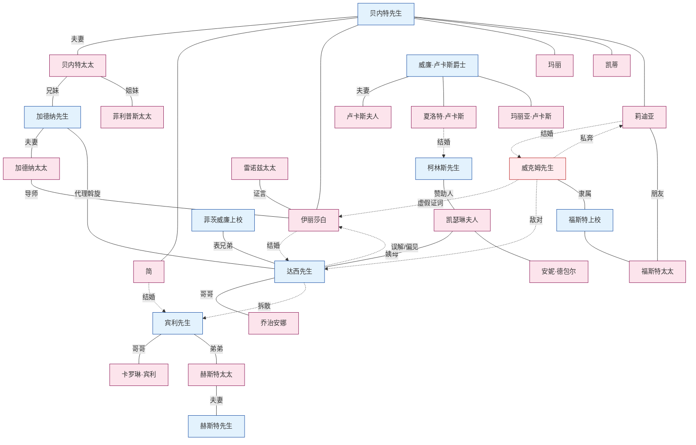

# 《傲慢与偏见》人物关系图

本文按家族与群体整理小说中的全部人物，并将主要叙事弧的人物关系结构可视化。各人物的详细经历见其独立`.md`文件。

---

## 1. 按家族与群体划分的人物构成

### 贝内特家——赫特福德郡浪搏恩
这是一个受限嗣继承约束的乡绅家庭；若无男性继承人，产业将落入柯林斯手中。五个女儿的婚姻是家族唯一的生存策略。

```
贝内特先生 ─── 贝内特太太
       │
       ├── 简（长女，22岁）──→ 宾利先生
       ├── 伊丽莎白“丽兹”（次女，20岁）──→ 达西先生
       ├── 玛丽（三女）
       ├── 凯蒂（凯瑟琳，四女）
       └── 莉迪亚（幼女，15岁）──→ 威克姆先生
```

- **夫妻关系：**讥诮的丈夫与缺乏判断力的妻子。作品含蓄地控诉婚姻失败如何导致教养失败。
- **父亲与伊丽莎白：**家中唯一的思想交流，同时伴有公开的偏爱。
- **母亲与莉迪亚：**幼女既是母亲最宠爱的孩子，也是她缺乏判断力的复制品。

### 达西家——德比郡彭伯里
年收入一万英镑的大贵族家族。彭伯里是原作的象征中心。

```
[已故达西先生——已故安妮·达西夫人]
          │
          ├── 达西先生（菲茨威廉·达西，约28岁）
          └── 乔治安娜·达西（妹妹，16岁）

母系家族：
凯瑟琳·德包尔夫人——[已故刘易斯·德包尔爵士]
          │                        │
   （安妮·达西夫人的姐妹）     安妮·德包尔小姐（表妹）
                                    └── 詹金森太太（陪伴人）

表兄弟：
菲茨威廉上校（___伯爵的次子，达西的共同监护人）

仆人与管理人员：
雷诺兹太太（彭伯里女管家，从达西4岁起便认识他）
```

- **达西与乔治安娜：**年长十五岁的兄长，父亲去世后担任共同监护人。她是他唯一的近亲，也是最珍贵的保护对象。
- **凯瑟琳夫人与达西：**他的姨母。她期待达西与德包尔小姐进行政治联姻，但达西毫无此意。
- **菲茨威廉与达西：**表兄弟，也是乔治安娜的共同监护人。停留汉斯福德期间，菲茨威廉无意间向伊丽莎白泄露达西拆散宾利与简的关键信息（EVT-027）。

### 宾利家——租住内瑟菲尔德
父亲经商积累十万英镑财富的新兴富裕家庭。家族目标是购置地产，跻身乡绅阶层。

```
宾利先生（查尔斯，年收入5,000英镑）
      │
   ├── 宾利小姐（卡罗琳，未婚妹妹）
   └── 赫斯特太太（路易莎，姐姐）── 赫斯特先生（懒散的闲人）
```

- **宾利与达西：**朋友兼导师关系。宾利几乎盲目地依赖达西。
- **卡罗琳与达西：**单方面求爱。她把达西对伊丽莎白的兴趣视为最大威胁。
- **卡罗琳与简：**虚伪的友谊；卡罗琳是拆散两人的共谋者。

### 柯林斯与卢卡斯——汉斯福德／卢卡斯庄园
限嗣继承与社会晋升的交汇点。

```
威廉·卢卡斯爵士 ─── 卢卡斯夫人
       │
       ├── 夏洛特（27岁）──→ 柯林斯先生（结婚）
       ├── 玛丽亚（妹妹）
       └── 弟弟们

柯林斯先生
  — 贝内特先生的远房侄辈，浪搏恩的预定继承人
  — 汉斯福德教区牧师
  — 赞助人：凯瑟琳·德包尔夫人
```

- **柯林斯与凯瑟琳夫人：**极端奉承的关系。凯瑟琳是柯林斯一切行为的准则。
- **夏洛特与伊丽莎白：**亲密友谊因婚姻观冲突而出现裂痕（EVT-020）。
- **柯林斯与伊丽莎白：**求婚后被拒，继而怀有无声的怨恨。

### 加德纳与菲利普斯——贝内特太太的娘家
贝内特太太的兄姐。虽有相同血缘，却形成截然相反的两极。

```
加德纳先生（贝内特太太的哥哥，伦敦商人）
       ── 加德纳太太（德比郡兰姆顿出身）
       — 居住在奇普赛德格雷斯丘奇街
       — 作品中的道德锚点

菲利普斯太太（贝内特太太的姐姐）
       — 菲利普斯先生（梅里屯律师，曾任贝内特先生父亲的书记员）
       — 居住在梅里屯，是缺乏判断力的另一个样本
```

- **加德纳夫妇与伊丽莎白、简：**既是朋友与导师，也是外甥女们的救援者。
- **加德纳太太与伊丽莎白：**三阶段导师关系——早期警告威克姆、引导她前往彭伯里、写下EVT-042的关键书信。
- **加德纳先生：**莉迪亚私奔危机中实际的家长。表面上是莉迪亚婚姻的安排者，实则是达西的代理人。

### 民兵人脉——梅里屯
秋冬驻扎在梅里屯的___郡民兵，经由威克姆与贝内特家纠缠在一起。

```
福斯特上校 ─── 福斯特太太（新婚，莉迪亚的朋友）
       │
       ├── 威克姆先生（民兵少尉，后为正规军少尉）
       ├── 丹尼先生（威克姆的朋友）
       └── 卡特上尉
```

- **福斯特太太与莉迪亚：**同龄朋友关系成为莉迪亚随她前往布莱顿的理由（EVT-032）。
- **福斯特上校与贝内特先生：**合作追踪私奔后的莉迪亚。

### 其他人物
- **金小姐（玛丽·金）：**继承一万英镑的女子，威克姆一度追求的对象（EVT-022）。
- **杨太太：**乔治安娜的前陪伴人。一年前与威克姆共谋诱骗乔治安娜；莉迪亚与威克姆逃往伦敦时又提供藏身处。
- **琼斯先生：**梅里屯的药剂师，治疗简的感冒。
- **雷诺兹太太：**彭伯里女管家，是促成伊丽莎白改变对达西认识的关键证人（EVT-035）。

---

## 2. 核心叙事弧

### 叙事弧1：双重婚姻情节——两段求爱
小说的主轴。

```
[简—宾利线]                         [伊丽莎白—达西线]
    彼此好感（EVT-003）                  梅里屯受辱（EVT-003）
         ↓                                   ↓
    留宿内瑟菲尔德（EVT-006）           被“fine eyes”吸引（EVT-004）
         ↓                                   ↓
    宾利离开（EVT-019）                  冲突加深（EVT-009、016）
         ↓                                   ↓
    ★ 达西拆散两人 ──────────────→ 第一次求婚失败（EVT-028）
         ↓                                   ↓
    伦敦的痛苦（EVT-021、023）          达西的信（EVT-029）
         ↓                                   ↓
    阻隔解除 ←───────────────── 彭伯里重逢（EVT-036）
         ↓                                   ↓
    宾利归来（EVT-043）                 秘密救援（EVT-042）
         ↓                                   ↓
    宾利求婚（EVT-044）                 第二次求婚（EVT-046）
         ↓                                   ↓
              ★ 双重婚姻（EVT-048）★
```

达西是两条线的交汇点：在简的线上，他从阻挠者变为解决者；在伊丽莎白的线上，他经历被拒、自我改革与再次求婚。

### 叙事弧2：偏见的形成与消解
伊丽莎白的认识变化构成叙事的另一条轴线。

```
达西 → 威克姆（童年伙伴）
   ↓   虐待（谎言）
威克姆 → 伊丽莎白（EVT-014，虚假证词）
   ↓   植入偏见
伊丽莎白 → 达西（憎恶固化）
   ↓   拒绝第一次求婚（EVT-028）
达西 → 伊丽莎白（信件，EVT-029）
   ↓   揭露真相
伊丽莎白 → 自己（EVT-030，“I never knew myself”）
   ↓   偏见消解
伊丽莎白 → 达西（尊敬、感激、爱情，EVT-035、041）
```

### 叙事弧3：威克姆的破坏路径
威克姆先后三次企图诱骗女性。

```
1）乔治安娜·达西（一年前，未遂）——达西及时发现；由EVT-029的信揭露
2）金小姐（梅里屯，未遂）——叔父介入并将她带走，EVT-022
3）莉迪亚·贝内特（布莱顿→伦敦，成功私奔）——达西用金钱收拾残局，EVT-038–042
```

威克姆的共犯：**杨太太**，参与一年前的乔治安娜事件，并为莉迪亚私奔提供藏身处。

### 叙事弧4：限嗣继承的压力
限嗣继承是婚姻情节的结构性背景。

```
贝内特先生去世时
    ↓ 限嗣继承，只限男性继承人
柯林斯先生继承
    ↓
贝内特太太与未婚女儿们 → 面临贫困威胁

压力的后果：
  — 贝内特太太对婚姻的执迷
  — 柯林斯向贝内特家的女儿求婚，出于义务感并试图调和继承矛盾
  — 夏洛特接受柯林斯，27岁时的经济防卫
```

### 叙事弧5：导师与助手结构
支持伊丽莎白成长的成年导师网络。

```
加德纳夫妇 ─ 道德导师
    ├── 警告威克姆
    ├── 引导前往彭伯里
    └── 救援莉迪亚，作为达西的代理人

雷诺兹太太 ─ 改变伊丽莎白对达西认识的外部证人

菲茨威廉上校 ─ 无意传递信息的人（EVT-027）

加德纳太太的信（EVT-042）─ 揭露秘密斡旋的人
```

### 叙事弧6：对立者轴线
小说中的结构性对立者。

```
凯瑟琳·德包尔夫人
  — 阶级秩序的化身
  — 直接威胁伊丽莎白（EVT-045）
  — 却又悖论式地催生第二次求婚

宾利小姐
  — 阶级上升欲望的化身
  — 拆散两人的共谋者，在彭伯里受到礼貌疏远

柯林斯先生
  — 奉承与虚荣的化身
  — 与其说是对立者，不如说是讽刺对象

威克姆先生
  — 唯一真正的恶徒
  — 诱骗女性、说谎、赌博
```

---

## 3. Mermaid关系图



---

## 4. 与主要住所及地点的联系

| 地点 | 居住或有关人物 |
|------|----------------|
| **浪搏恩** | 贝内特全家 |
| **内瑟菲尔德庄园** | 宾利租住；达西与赫斯特一家停留 |
| **彭伯里**（德比郡） | 达西、乔治安娜、雷诺兹太太 |
| **罗新斯庄园**（肯特） | 凯瑟琳夫人、德包尔小姐、詹金森太太 |
| **汉斯福德牧师住宅** | 柯林斯、夏洛特 |
| **卢卡斯庄园** | 卢卡斯家 |
| **梅里屯** | 菲利普斯家、民兵、金小姐 |
| **格雷斯丘奇街**（伦敦） | 加德纳家 |
| **格罗夫纳街／赫斯特家**（伦敦） | 赫斯特夫妇与宾利小姐的冬季住所 |
| **布莱顿** | 福斯特夫妇、莉迪亚、威克姆（私奔前） |
| **兰姆顿**（德比郡） | 加德纳太太的故乡、参观彭伯里的落脚点 |
| **格雷特纳格林**（苏格兰） | 莉迪亚私奔时伪装的目的地，实际未抵达 |
| **纽卡斯尔** | 婚后威克姆与莉迪亚所属的正规军团 |

---

## 5. 结局时的最终安置

- **彭伯里（达西 ↔ 伊丽莎白）：**乔治安娜与他们同住；加德纳夫妇作为最受爱戴的亲戚受到邀请。
- **内瑟菲尔德 → 一年后迁至德比郡（宾利 ↔ 简）：**迁到距达西庄园三十英里以内。
- **浪搏恩（贝内特夫妇＋玛丽＋凯蒂）：**凯蒂受姐姐们影响而改善；玛丽成为家中唯一留下的女儿。
- **纽卡斯尔（威克姆 ↔ 莉迪亚）：**长期陷于经济困难，向姐姐们求助。达西禁止威克姆进入彭伯里。
- **罗新斯（凯瑟琳夫人）：**与他们断绝来往一段时间后和解。
- **汉斯福德（柯林斯 ↔ 夏洛特）：**继续生活在凯瑟琳夫人的阴影下。
- **格雷斯丘奇街（加德纳夫妇）：**继续与达西、伊丽莎白夫妇保持深厚交往。

---

*参考：各人物详情见`[人物名].md`文件。事件编号（EVT-XXX）见`event_master.csv`。*
