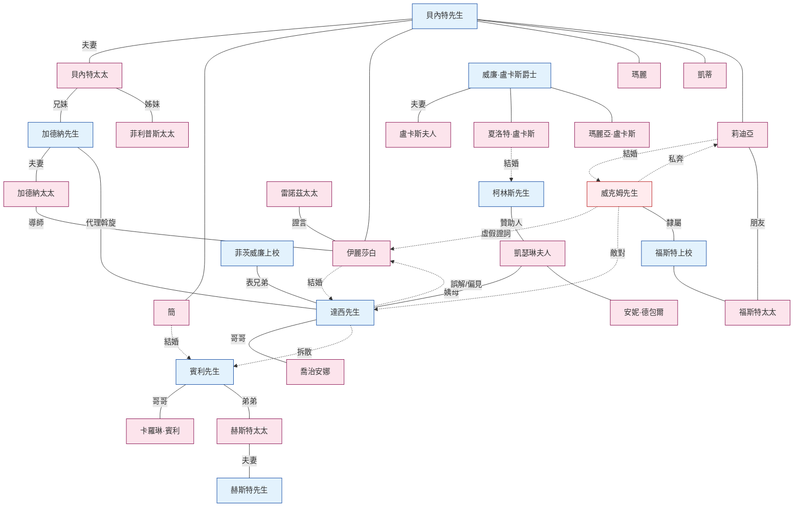

# 《傲慢與偏見》人物關係圖

本文按家族與群體整理小說中的全部人物，並將主要敘事弧的人物關係結構視覺化。各人物的詳細經歷見其獨立`.md`檔案。

---

## 1. 按家族與群體劃分的人物構成

### 貝內特家——赫特福德郡浪搏恩
這是一個受限嗣繼承約束的鄉紳家庭；若無男性繼承人，產業將落入柯林斯手中。五個女兒的婚姻是家族唯一的生存策略。

```
貝內特先生 ─── 貝內特太太
       │
       ├── 簡（長女，22歲）──→ 賓利先生
       ├── 伊麗莎白“麗茲”（次女，20歲）──→ 達西先生
       ├── 瑪麗（三女）
       ├── 凱蒂（凱瑟琳，四女）
       └── 莉迪亞（幼女，15歲）──→ 威克姆先生
```

- **夫妻關係：**譏誚的丈夫與缺乏判斷力的妻子。作品含蓄地控訴婚姻失敗如何導致教養失敗。
- **父親與伊麗莎白：**家中唯一的思想交流，同時伴有公開的偏愛。
- **母親與莉迪亞：**幼女既是母親最寵愛的孩子，也是她缺乏判斷力的複製品。

### 達西家——德比郡彭伯里
年收入一萬英鎊的大貴族家族。彭伯里是原作的象徵中心。

```
[已故達西先生——已故安妮·達西夫人]
          │
          ├── 達西先生（菲茨威廉·達西，約28歲）
          └── 喬治安娜·達西（妹妹，16歲）

母系家族：
凱瑟琳·德包爾夫人——[已故劉易斯·德包爾爵士]
          │                        │
   （安妮·達西夫人的姊妹）     安妮·德包爾小姐（表妹）
                                    └── 詹金森太太（陪伴人）

表兄弟：
菲茨威廉上校（___伯爵的次子，達西的共同監護人）

僕人與管理人員：
雷諾茲太太（彭伯里女管家，從達西4歲起便認識他）
```

- **達西與喬治安娜：**年長十五歲的兄長，父親去世後擔任共同監護人。她是他唯一的近親，也是最珍貴的保護對象。
- **凱瑟琳夫人與達西：**他的姨母。她期待達西與德包爾小姐進行政治聯姻，但達西毫無此意。
- **菲茨威廉與達西：**表兄弟，也是喬治安娜的共同監護人。停留漢斯福德期間，菲茨威廉無意間向伊麗莎白洩露達西拆散賓利與簡的關鍵資訊（EVT-027）。

### 賓利家——租住內瑟菲爾德
父親經商積累十萬英鎊財富的新興富裕家庭。家族目標是購置地產，躋身鄉紳階層。

```
賓利先生（查爾斯，年收入5,000英鎊）
      │
   ├── 賓利小姐（卡羅琳，未婚妹妹）
   └── 赫斯特太太（路易莎，姊姊）── 赫斯特先生（懶散的閒人）
```

- **賓利與達西：**朋友兼導師關係。賓利幾乎盲目地依賴達西。
- **卡羅琳與達西：**單方面求愛。她把達西對伊麗莎白的興趣視為最大威脅。
- **卡羅琳與簡：**虛偽的友誼；卡羅琳是拆散兩人的共謀者。

### 柯林斯與盧卡斯——漢斯福德／盧卡斯莊園
限嗣繼承與社會晉升的交匯點。

```
威廉·盧卡斯爵士 ─── 盧卡斯夫人
       │
       ├── 夏洛特（27歲）──→ 柯林斯先生（結婚）
       ├── 瑪麗亞（妹妹）
       └── 弟弟們

柯林斯先生
  — 貝內特先生的遠房侄輩，浪搏恩的預定繼承人
  — 漢斯福德教區牧師
  — 贊助人：凱瑟琳·德包爾夫人
```

- **柯林斯與凱瑟琳夫人：**極端奉承的關係。凱瑟琳是柯林斯一切行為的準則。
- **夏洛特與伊麗莎白：**親密友誼因婚姻觀衝突而出現裂痕（EVT-020）。
- **柯林斯與伊麗莎白：**求婚後被拒，繼而懷有無聲的怨恨。

### 加德納與菲利普斯——貝內特太太的孃家
貝內特太太的兄姐。雖有相同血緣，卻形成截然相反的兩極。

```
加德納先生（貝內特太太的哥哥，倫敦商人）
       ── 加德納太太（德比郡蘭姆頓出身）
       — 居住在奇普賽德格雷斯丘奇街
       — 作品中的道德錨點

菲利普斯太太（貝內特太太的姊姊）
       — 菲利普斯先生（梅里屯律師，曾任貝內特先生父親的書記員）
       — 居住在梅里屯，是缺乏判斷力的另一個樣本
```

- **加德納夫婦與伊麗莎白、簡：**既是朋友與導師，也是外甥女們的救援者。
- **加德納太太與伊麗莎白：**三階段導師關係——早期警告威克姆、引導她前往彭伯里、寫下EVT-042的關鍵書信。
- **加德納先生：**莉迪亞私奔危機中實際的家長。表面上是莉迪亞婚姻的安排者，實則是達西的代理人。

### 民兵人脈——梅里屯
秋冬駐紮在梅里屯的___郡民兵，經由威克姆與貝內特家糾纏在一起。

```
福斯特上校 ─── 福斯特太太（新婚，莉迪亞的朋友）
       │
       ├── 威克姆先生（民兵少尉，後為正規軍少尉）
       ├── 丹尼先生（威克姆的朋友）
       └── 卡特上尉
```

- **福斯特太太與莉迪亞：**同齡朋友關係成為莉迪亞隨她前往布萊頓的理由（EVT-032）。
- **福斯特上校與貝內特先生：**合作追蹤私奔後的莉迪亞。

### 其他人物
- **金小姐（瑪麗·金）：**繼承一萬英鎊的女子，威克姆一度追求的對象（EVT-022）。
- **楊太太：**喬治安娜的前陪伴人。一年前與威克姆共謀誘騙喬治安娜；莉迪亞與威克姆逃往倫敦時又提供藏身處。
- **瓊斯先生：**梅里屯的藥劑師，治療簡的感冒。
- **雷諾茲太太：**彭伯里女管家，是促成伊麗莎白改變對達西認識的關鍵證人（EVT-035）。

---

## 2. 核心敘事弧

### 敘事弧1：雙重婚姻情節——兩段求愛
小說的主軸。

```
[簡—賓利線]                         [伊麗莎白—達西線]
    彼此好感（EVT-003）                  梅里屯受辱（EVT-003）
         ↓                                   ↓
    留宿內瑟菲爾德（EVT-006）           被“fine eyes”吸引（EVT-004）
         ↓                                   ↓
    賓利離開（EVT-019）                  衝突加深（EVT-009、016）
         ↓                                   ↓
    ★ 達西拆散兩人 ──────────────→ 第一次求婚失敗（EVT-028）
         ↓                                   ↓
    倫敦的痛苦（EVT-021、023）          達西的信（EVT-029）
         ↓                                   ↓
    阻隔解除 ←───────────────── 彭伯里重逢（EVT-036）
         ↓                                   ↓
    賓利歸來（EVT-043）                 秘密救援（EVT-042）
         ↓                                   ↓
    賓利求婚（EVT-044）                 第二次求婚（EVT-046）
         ↓                                   ↓
              ★ 雙重婚姻（EVT-048）★
```

達西是兩條線的交匯點：在簡的線上，他從阻撓者變為解決者；在伊麗莎白的線上，他經歷被拒、自我改革與再次求婚。

### 敘事弧2：偏見的形成與消解
伊麗莎白的認識變化構成敘事的另一條軸線。

```
達西 → 威克姆（童年夥伴）
   ↓   虐待（謊言）
威克姆 → 伊麗莎白（EVT-014，虛假證詞）
   ↓   植入偏見
伊麗莎白 → 達西（憎惡固化）
   ↓   拒絕第一次求婚（EVT-028）
達西 → 伊麗莎白（信件，EVT-029）
   ↓   揭露真相
伊麗莎白 → 自己（EVT-030，“I never knew myself”）
   ↓   偏見消解
伊麗莎白 → 達西（尊敬、感激、愛情，EVT-035、041）
```

### 敘事弧3：威克姆的破壞路徑
威克姆先後三次企圖誘騙女性。

```
1）喬治安娜·達西（一年前，未遂）——達西及時發現；由EVT-029的信揭露
2）金小姐（梅里屯，未遂）——叔父介入並將她帶走，EVT-022
3）莉迪亞·貝內特（布萊頓→倫敦，成功私奔）——達西用金錢收拾殘局，EVT-038–042
```

威克姆的共犯：**楊太太**，參與一年前的喬治安娜事件，併為莉迪亞私奔提供藏身處。

### 敘事弧4：限嗣繼承的壓力
限嗣繼承是婚姻情節的結構性背景。

```
貝內特先生去世時
    ↓ 限嗣繼承，只限男性繼承人
柯林斯先生繼承
    ↓
貝內特太太與未婚女兒們 → 面臨貧困威脅

壓力的後果：
  — 貝內特太太對婚姻的執迷
  — 柯林斯向貝內特家的女兒求婚，出於義務感並試圖調和繼承矛盾
  — 夏洛特接受柯林斯，27歲時的經濟防衛
```

### 敘事弧5：導師與助手結構
支援伊麗莎白成長的成年導師網路。

```
加德納夫婦 ─ 道德導師
    ├── 警告威克姆
    ├── 引導前往彭伯里
    └── 救援莉迪亞，作為達西的代理人

雷諾茲太太 ─ 改變伊麗莎白對達西認識的外部證人

菲茨威廉上校 ─ 無意傳遞資訊的人（EVT-027）

加德納太太的信（EVT-042）─ 揭露秘密斡旋的人
```

### 敘事弧6：對立者軸線
小說中的結構性對立者。

```
凱瑟琳·德包爾夫人
  — 階級秩序的化身
  — 直接威脅伊麗莎白（EVT-045）
  — 卻又悖論式地催生第二次求婚

賓利小姐
  — 階級上升慾望的化身
  — 拆散兩人的共謀者，在彭伯里受到禮貌疏遠

柯林斯先生
  — 奉承與虛榮的化身
  — 與其說是對立者，不如說是諷刺對象

威克姆先生
  — 唯一真正的惡徒
  — 誘騙女性、說謊、賭博
```

---

## 3. Mermaid關係圖



---

## 4. 與主要住所及地點的聯絡

| 地點 | 居住或有關人物 |
|------|----------------|
| **浪搏恩** | 貝內特全家 |
| **內瑟菲爾德莊園** | 賓利租住；達西與赫斯特一家停留 |
| **彭伯里**（德比郡） | 達西、喬治安娜、雷諾茲太太 |
| **羅新斯莊園**（肯特） | 凱瑟琳夫人、德包爾小姐、詹金森太太 |
| **漢斯福德牧師館** | 柯林斯、夏洛特 |
| **盧卡斯莊園** | 盧卡斯家 |
| **梅里屯** | 菲利普斯家、民兵、金小姐 |
| **格雷斯丘奇街**（倫敦） | 加德納家 |
| **格羅夫納街／赫斯特家**（倫敦） | 赫斯特夫婦與賓利小姐的冬季住所 |
| **布萊頓** | 福斯特夫婦、莉迪亞、威克姆（私奔前） |
| **蘭姆頓**（德比郡） | 加德納太太的故鄉、參觀彭伯里的落腳點 |
| **格雷特納格林**（蘇格蘭） | 莉迪亞私奔時偽裝的目的地，實際未抵達 |
| **紐卡斯爾** | 婚後威克姆與莉迪亞所屬的正規軍團 |

---

## 5. 結局時的最終安置

- **彭伯里（達西 ↔ 伊麗莎白）：**喬治安娜與他們同住；加德納夫婦作為最受愛戴的親戚受到邀請。
- **內瑟菲爾德 → 一年後遷至德比郡（賓利 ↔ 簡）：**遷到距達西莊園三十英里以內。
- **浪搏恩（貝內特夫婦＋瑪麗＋凱蒂）：**凱蒂受姊姊們影響而改善；瑪麗成為家中唯一留下的女兒。
- **紐卡斯爾（威克姆 ↔ 莉迪亞）：**長期陷於經濟困難，向姊姊們求助。達西禁止威克姆進入彭伯里。
- **羅新斯（凱瑟琳夫人）：**與他們斷絕來往一段時間後和解。
- **漢斯福德（柯林斯 ↔ 夏洛特）：**繼續生活在凱瑟琳夫人的陰影下。
- **格雷斯丘奇街（加德納夫婦）：**繼續與達西、伊麗莎白夫婦保持深厚交往。

---

*參考：各人物詳情見`[人物名].md`檔案。事件編號（EVT-XXX）見`event_master.csv`。*
